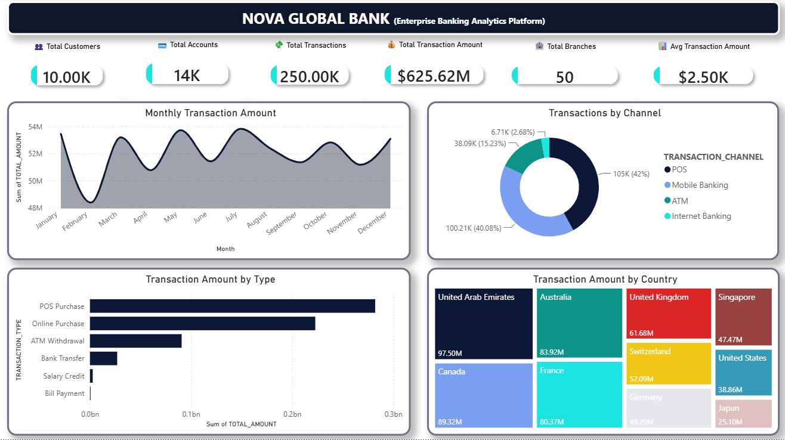
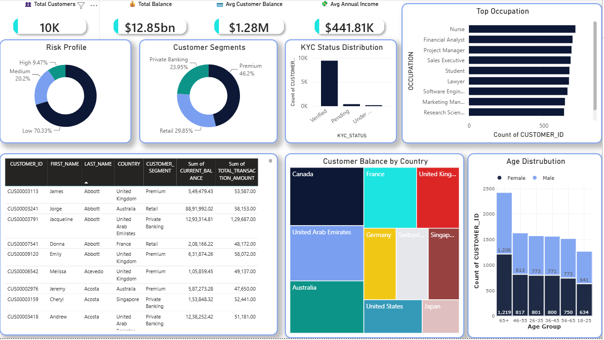
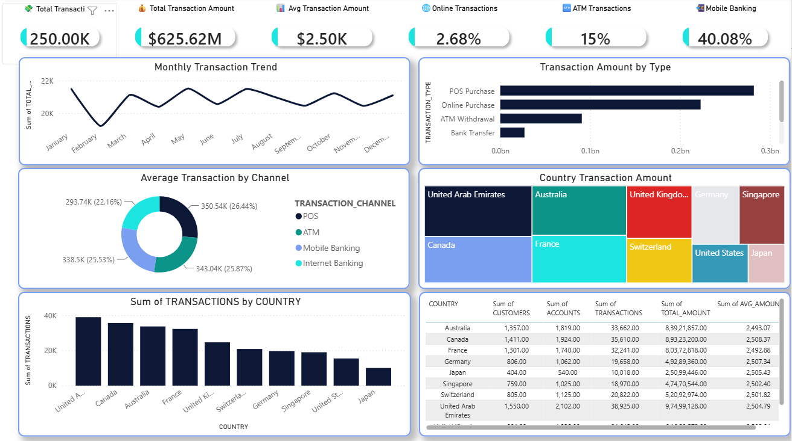
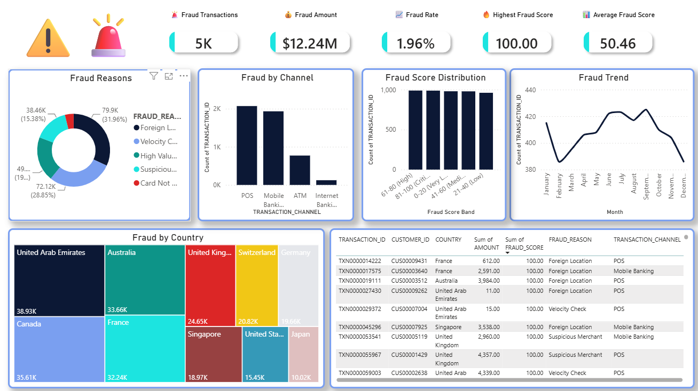

# 🏦 Snowflake Banking Fraud Analytics

> An end-to-end Banking Analytics & Fraud Intelligence solution built using **Python, Snowflake, SQL, and Power BI**.


---

## 📌 Project Overview

Banks generate millions of transactions every day, making it difficult to monitor customer activity, identify suspicious behavior, and provide executives with meaningful insights.

This project simulates a modern banking analytics platform by generating synthetic banking data, loading it into Snowflake, building an analytics layer using SQL views, and creating interactive Power BI dashboards for executive reporting, customer analytics, transaction intelligence, and fraud monitoring.

The project demonstrates an end-to-end cloud analytics pipeline similar to what is used in enterprise banking environments.
## 🚀 Tech Stack

| Category | Technology |
|----------|------------|
| Programming | Python |
| Data Warehouse | Snowflake |
| Database | SQL |
| Visualization | Power BI |
| Data Modeling | Star Schema |
| Version Control | Git & GitHub |
| Connectivity | Snowflake ODBC |

## 📂 Project Architecture

```
Python Data Generators
        │
        ▼
CSV Dataset
        │
        ▼
Snowflake Internal Stage
        │
        ▼
RAW Tables
        │
        ▼
Analytics Views
        │
        ▼
Power BI Semantic Model
        │
        ▼
Interactive Dashboards
```

---

# 📊 Dashboard Preview

## 🏆 Executive Dashboard

Provides a high-level overview of banking operations with key business KPIs.

**Highlights**

- Total Customers
- Total Accounts
- Total Transactions
- Total Transaction Amount
- Monthly Transaction Trend
- Transaction Channel Distribution
- Country-wise Performance

> 

---

## 👥 Customer Analytics

A 360° customer view helping analyze customer demographics, segmentation, balances, and KYC compliance.

**Highlights**

- Customer Segments
- Risk Profile
- Occupation Analysis
- Customer Balance by Country
- KYC Status
- Customer Age Distribution
- Top Customers

> 

---

## 💳 Transaction Intelligence

Provides insights into transaction behavior across countries, channels, and transaction types.

**Highlights**

- Monthly Transaction Trend
- Transaction Amount by Type
- Transaction Amount by Country
- Channel-wise Analysis
- Country Performance
- Transaction KPIs

> 

---

## 🚨 Fraud Intelligence

Interactive fraud monitoring dashboard for identifying suspicious transactions and fraud patterns.

**Highlights**

- Fraud Rate
- Fraud Amount
- Fraud Reasons
- Fraud by Country
- Fraud by Channel
- Fraud Trend
- High-Risk Transactions

> 

---

# ✨ Key Features

- 🔹 End-to-end Banking Analytics solution using Snowflake and Power BI
- 🔹 Synthetic banking dataset generated using Python
- 🔹 Cloud-based data warehouse built on Snowflake
- 🔹 SQL-based analytics layer with reusable views
- 🔹 Customer 360 analytics
- 🔹 Executive KPI reporting
- 🔹 Transaction Intelligence dashboard
- 🔹 Fraud Intelligence dashboard
- 🔹 Interactive Power BI reports with DAX measures
- 🔹 Modular project structure suitable for enterprise environments

---

# 📊 Dataset Summary

| Dataset | Records |
|---------|--------:|
| Customers | 10,000 |
| Accounts | 13,500 |
| Transactions | 250,000 |
| Branches | 50 |
| Countries | 10 |
| Dashboards | 4 |

---

# 🗄️ Analytics Views

The analytics layer is built using SQL views to separate business logic from reporting.

### Implemented Views

- Executive_Summary
- Customer_360
- Customer_Summary
- Branch_Performance
- Country_Performance
- Transaction_Analytics
- High_Value_Customers
- Fraud_Analytics

---

# 📈 Power BI Reports

The Power BI solution consists of four interactive dashboards:

| Dashboard | Description |
|------------|-------------|
| Executive Dashboard | Executive KPIs and business overview |
| Customer Analytics | Customer demographics and segmentation |
| Transaction Intelligence | Transaction trends and channel analytics |
| Fraud Intelligence | Fraud monitoring and investigation |

---

# 💼 Skills Demonstrated

### Data Engineering

- Python
- CSV Data Generation
- ETL Pipeline
- Data Cleaning

### Cloud Data Warehouse

- Snowflake
- Internal Stage
- COPY INTO
- SQL Views
- Data Modeling

### Business Intelligence

- Power BI
- DAX
- Power Query
- Data Visualization
- Interactive Dashboards

### Analytics

- Executive Reporting
- Customer Analytics
- Transaction Analytics
- Fraud Intelligence

---

# 🏦 Business Use Case

Financial institutions process millions of transactions daily across multiple channels and countries. This project demonstrates how modern analytics platforms can transform raw transactional data into actionable insights for executives, analysts, and fraud investigation teams.

The solution provides:

- Executive KPI reporting
- Customer behavior analysis
- Transaction intelligence
- Fraud monitoring
- Country-level performance analysis

---

# ⚙️ Installation

## Clone the Repository

```bash
git clone https://github.com/saurabh71718/Snowflake-Banking-Fraud-Analytics.git
```

## Navigate to the Project

```bash
cd Snowflake-Banking-Fraud-Analytics
```

## Install Dependencies

```bash
pip install -r requirements.txt
```

## Configure Snowflake

Update your Snowflake credentials inside:

```
scripts/config/settings.py
```

Then execute the SQL scripts in the following order:

1. 01_create_database.sql
2. 02_create_tables.sql
3. 03_load_data.sql
4. 05_create_transaction_table.sql
5. 06_generate_transactions.sql
6. 07_analytics_views.sql
7. 08_fraud_views.sql

Finally, open the Power BI report located in:

```
powerbi/Banking_Fraud_Analytics.pbix
```

---

# 📂 Project Structure

```
Snowflake-Banking-Fraud-Analytics
│
├── dataset/
├── documentation/
├── images/
├── powerbi/
├── scripts/
├── sql/
├── README.md
├── LICENSE
├── requirements.txt
└── .gitignore
```

---

# 🚀 Future Enhancements

- Real-time streaming using Snowpipe
- Incremental data loading
- Dynamic Row-Level Security (RLS)
- Predictive fraud detection using Machine Learning
- Power BI deployment to Microsoft Fabric
- Snowflake Tasks & Streams automation
- CI/CD pipeline using GitHub Actions

---

# 👨‍💻 About the Author

**Saurabh Gore**

Data Analyst | Power BI Developer | SQL | Snowflake | Microsoft Fabric | Python | Databricks

Passionate about building scalable analytics solutions that transform raw data into actionable business insights.

📫 Feel free to connect on LinkedIn or explore more projects on GitHub.

## 🎯 Project Highlights

- ✅ 250,000+ Banking Transactions Analyzed
- ✅ 10,000 Customers Across 10 Countries
- ✅ End-to-End Snowflake Data Warehouse
- ✅ Interactive Power BI Dashboards
- ✅ Fraud Intelligence & Customer 360 Analytics
- ✅ Modular Python Data Generation Pipeline
